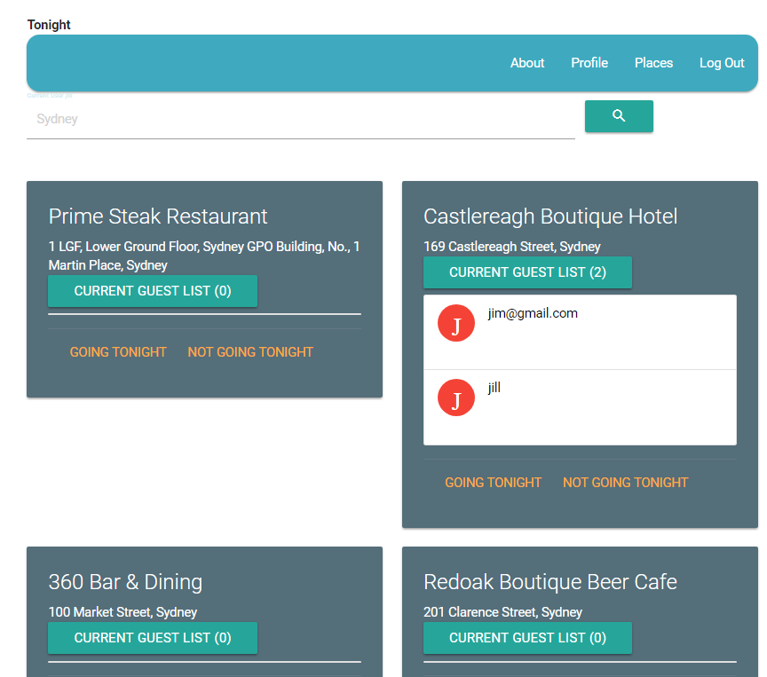

# fcc-tonight-v2
Free Code Camp - Build a Nightlife Coordination App

## Purpose - Build a Nightlife Coordination App
https://www.freecodecamp.org/challenges/build-a-nightlife-coordination-app

## Here are the specific user stories you should implement for this project

User Story: As an unauthenticated user, I can view all bars in my area.

User Story: As an authenticated user, I can add myself to a bar to indicate I am going there tonight.

User Story: As an authenticated user, I can remove myself from a bar if I no longer want to go there.

User Story: As an unauthenticated user, when I login I should not have to search again.

### This project requires
MongoDB installed and running

Node installed

#### In a command prompt browse to the root of the folder run 

npm install

npm install -g bower

bower install